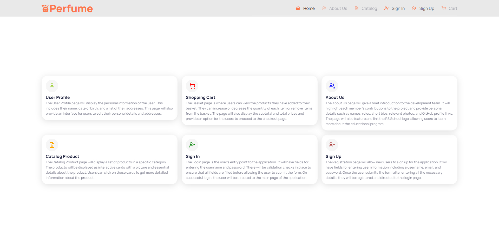
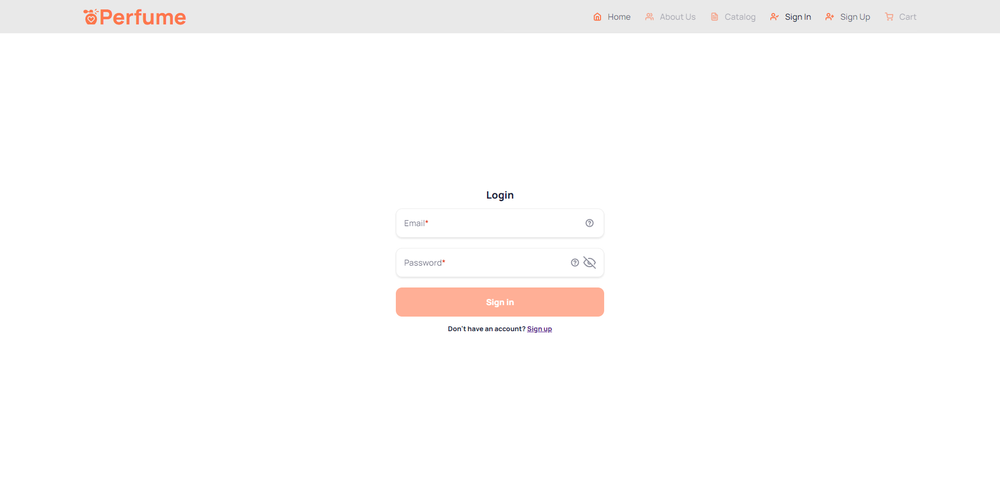
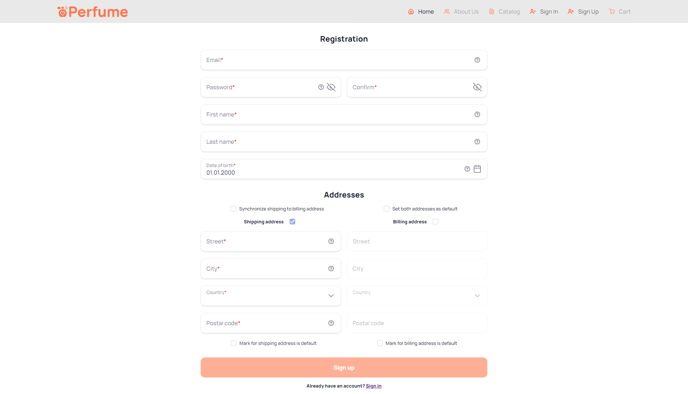

# E-COMMERCE

## Description:

This platform is an online shopping portal that replicates real-world shopping experiences in a digital environment. It provides a comprehensive and interactive shopping experience for users, allowing them to browse through a wide range of fragrance products, view detailed descriptions, add items to their basket, and proceed to checkout. The application includes features such as user registration and login, product search, categorization, and sorting. It is responsive and designed to look great on various devices. The key pages in the application include login and registration, main page, catalog product page, detailed product page, user profile page, basket page, and about us page. The application is powered by CommerceTools, a leading provider of commerce solutions for B2C and B2B enterprises.

## Goals:

- Provide a convenient and interactive platform for online shopping, replicating real-world shopping experiences.
- Offer a wide selection of fragrance products with detailed descriptions to enable informed purchasing decisions.
- Enhance the shopping experience through features such as user registration and login, product search, categorization, and sorting.
- Create a responsive and visually appealing design that ensures a seamless experience across different devices.
- Build trust and confidence in users by providing a secure and user-friendly checkout process.
- Deliver high-quality customer service and support to meet the needs and expectations of users.
- Collaborate with CommerceTools to leverage reliable and innovative commerce solutions for B2C and B2B enterprises.
- Increase user engagement and conversion rates to achieve the organization's business objectives.

This project was generated with [Angular CLI](https://github.com/angular/angular-cli) version 15.2.9.

## Authors

- [@AleksaRoad](https://github.com/AleksaRoad)
- [@alwaysadevzero](https://github.com/alwaysadevzero)

## Tech stack

  - TypeScript
  - SASS/SCSS
  - Angular
  - RxJS
  - NgRx
  - Taiga UI
  - Karma
  - Prettier
  - ESLint
  - Stylelint
  - Husky
  - Commitlint
  - Compodoc
  - NPM

## Deployment

<details>
<summary><h2>Screenshots</h2></summary>





</details>

## Installation

```bash
  git clone -b develop https://github.com/AleksaRoad/e-commerce.git
```

```bash
  npm install
```

```bash
  npm run start
```

## Development server

Run
```
  npm run start
```

for a dev server. Navigate to `http://localhost:4200/`. The application will automatically reload if you change any of the source files.

## Build

Run
```
  npm run build
```

to build the project. The build artifacts will be stored in the `dist/` directory.

## Running unit tests

Run
```
  npm run test
```

to execute the unit tests via [Karma](https://karma-runner.github.io).

## Generating documentation with Compodoc

Run
```
  compodoc:build
```
```
  compodoc:build-and-serve
```
```
  compodoc:serve
```

- compodoc:build: This script builds the documentation for your project using Compodoc based on the tsconfig.doc.json configuration file.


- compodoc:build-and-serve: This script builds the documentation using Compodoc and starts a server to view the generated documentation.

- compodoc:serve: This script starts a local server to view the pre-generated documentation using Compodoc.
